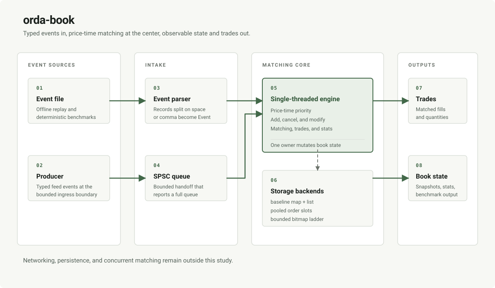

# orda-book

[](https://github.com/stra-ta/orda-book/actions/workflows/ci.yml)

orda-book is a single-threaded limit-order matching engine and replay lab.

The lab isolates matching semantics, storage backends, ingress partitioning, and measurement evidence.

orda-book is the low-latency application target in the [stra-ta systems lab](https://github.com/stra-ta).

## Evidence

Functional evidence is maintained by the CTest suite, the independent reference engine, sanitizer jobs, and the optional differential fuzzer.

The current suite covers FIFO matching, multi-level sweeps, cancellation, cancel-replace, parser boundaries, order-type policies, generated invariants, backend equivalence, and deterministic partition replay.

The performance table below is historical evidence from commit `3c79930`.

It is not a claim about the current commit, a production exchange, or a portable latency target.

| backend | cross-heavy throughput | modify-heavy p99 | allocations/event |
| --- | ---: | ---: | ---: |
| baseline | 10.2M ev/s | 375 ns | 1.60 |
| pooled | 18.3M ev/s | 292 ns | 0.801 |
| ladder | 8.12M ev/s | 292 ns | 1.60 |

The exact workload, environment, and limitations are recorded in [`docs/BENCHMARK_RESULTS.md`](docs/BENCHMARK_RESULTS.md).

Run `./scripts/check_evidence.sh` before changing a README claim or promoting a new result.

## Architecture



The baseline backend uses ordered bid and ask price maps with FIFO lists at each level.

The pooled backend uses stable preallocated order slots and is the current general-purpose successor candidate.

The ladder backend is a bounded price-domain experiment and is not a universal replacement.

The per-symbol partition lab routes each symbol to one single-writer matcher with bounded SPSC ingress.

The matching core has no network or persistence layer.

The event model supports limit and market adds, GTC, IOC, and FOK time-in-force policies, and explicit post-only rejection.

Market orders never rest by engine design; this is an inference from engine behavior, not a venue claim (see [`docs/VENUE_PARITY.md`](docs/VENUE_PARITY.md)).

IOC orders cancel any unfilled remainder.

FOK orders reject atomically when the complete quantity is not available at acceptable prices.

Post-only orders reject when they would immediately trade.

Self-trade prevention is intentionally not exposed until participant identity and cancellation policy are part of the contract.

## Build

Requirements: CMake 3.20 or newer and a C++17 compiler.

```sh
cmake -S . -B build -DCMAKE_BUILD_TYPE=Debug
cmake --build build --parallel
```

Replay a text event file without loading the complete file into memory:

```sh
./build/orda_replay data/sample_events.txt
./build/orda_replay data/sample_events.txt --top
```

Replay the versioned fixed-width binary format:

```sh
./build/orda_benchmark --events 200000 --workload cross-heavy --rounds 1 \
  --no-latency --write-binary-file /tmp/orda-events.bin
./build/orda_replay /tmp/orda-events.bin --binary --top
```

Run a generated benchmark:

```sh
./build/orda_benchmark \
  --events 200000 \
  --workload cross-heavy \
  --rounds 5 \
  --seed 305419896 \
  --backend pooled \
  --no-latency \
  --reuse-trades
```

Use `--backend baseline`, `--backend pooled`, or `--backend ladder`.

Use `--engine-only` to exclude text or binary parsing from the timed rounds.

Use `--binary` with `--file` to select the binary replay format.

Run the partition lab:

```sh
./build/orda_partition_lab \
  --generate 200000 \
  --shards 4 \
  --capacity 1024 \
  --seed 305419896
```

## Verification

The one-command verification entry point is:

```sh
./scripts/verify.sh
```

The full local confidence suite adds AddressSanitizer, UndefinedBehaviorSanitizer, binary replay, and a fuzzer smoke test when the local Clang runtime provides libFuzzer:

```sh
./scripts/full_confidence.sh
```

The normal CTest suite is functional evidence.

The benchmark binaries report measurements only when explicitly run and must record their commit, compiler, architecture, workload, seed, build type, and command line.

The optional fuzzer compares baseline, pooled, ladder, and an independent reference implementation within the ladder's valid price domain.

## Limitations

The engine is single-threaded at the matching boundary.

The partition lab is an experiment-local ingress boundary and does not provide a network protocol.

The ladder backend requires an inclusive configured price range.

The binary format is version 1 and little-endian.

Self-trade prevention, persistence, market-data networking, and response delivery are outside the current contract.

Historical performance numbers are not automatically refreshed and must not be copied into a current claim without a new committed artifact.

## Documentation

- [`docs/ARCHITECTURE.md`](docs/ARCHITECTURE.md): structures, event flow, complexity, and boundaries.
- [`docs/BACKEND_DECISION.md`](docs/BACKEND_DECISION.md): backend roles and promotion criteria.
- [`docs/CORRECTNESS_CAMPAIGN.md`](docs/CORRECTNESS_CAMPAIGN.md): invariants and reference-oracle campaign.
- [`docs/BENCHMARKING.md`](docs/BENCHMARKING.md): measurement method and interpretation rules.
- [`docs/BENCHMARK_RESULTS.md`](docs/BENCHMARK_RESULTS.md): historical result artifact and environment.
- [`docs/FUZZING.md`](docs/FUZZING.md): differential fuzzer build, minimization, and corpus handling.
- [`docs/VENUE_PARITY.md`](docs/VENUE_PARITY.md): engine matching rules versus production venue behavior.
- [`docs/INGRESS_BOUNDARY_DESIGN.md`](docs/INGRESS_BOUNDARY_DESIGN.md): partition and queue boundary.
- [`docs/ORDER_STORAGE_DESIGN.md`](docs/ORDER_STORAGE_DESIGN.md): pooled storage contract.
- [`docs/PRICE_LADDER_DESIGN.md`](docs/PRICE_LADDER_DESIGN.md): bounded ladder contract.
- [`docs/DEVELOPMENT_LOG.md`](docs/DEVELOPMENT_LOG.md): milestone history and open evidence gaps.

## License

Released under the [MIT License](LICENSE).
